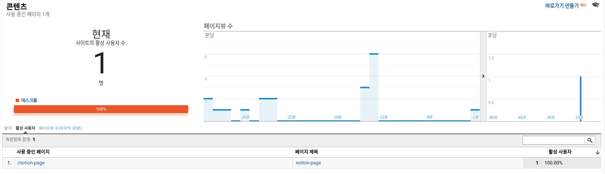
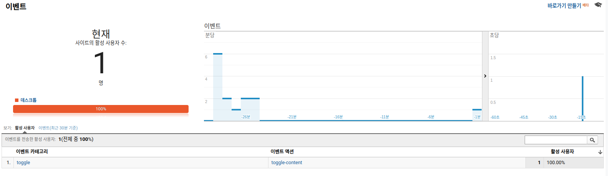

# ga-proxy

## 프록시 서버 실행

### 설정
설정을 위해, [GA track id](https://support.google.com/analytics/thread/13109681?hl=en)를 프로젝트 루트 디렉토리에 `config.json` 파일, 또는 원하는 파일에 작성하세요.

#### 예시
```json
{
    "ga_track_id": "UA-XXXXXX-Y" // your google analytics track id
}
```

### 설치
```bash
$ npm install
```

### 로컬 실행
```bash
$ npm run dev
```

### AWS에 서버리스로 배포하기
```bash
// uses config.json by default
$ npm run deploy

// specify config file
$ CONFIG_FILE=config.json npm run deploy
```

## 노션에 GA 연결하기

1. 먼저 프록시 서버를 배포하세요.
2. 프록시 서버의 주소를 잘 기억해 둡니다.
    - 아마 `https://XXXXXXXXXX.execute-api.ap-northeast-2.amazonaws.com/dev` 와 같은 형태입니다.
3. 노션에 이미지를 추가합니다.
    - "Embed Link" 를 선택하고, 추적하고 싶은 페이지나 이벤트에 따라 다음과 같은 링크를 입력합니다.
```
https://XXXXXXXXXX.execute-api.ap-northeast-2.amazonaws.com/dev?<쿼리 스트링>
```
- 쿼리 스트링은 다음과 같이 입력합니다.
    -  **(필수)** `type`: 페이지 트래킹이면 `pageview`, 이벤트 트래킹이면 `event`
    - `page`: 페이지 트래킹의 경우, 트래킹할 페이지 세부 url
    - `title`: 페이지 트래킹의 경우, 트래킹할 페이지의 제목
    - `ecategory`: 이벤트 트래킹의 경우, 트래킹할 이벤트 카테고리
    - `eaction`: 이벤트 트래킹의 경우, 트래킹할 이벤트 액션
    - `elabel`: 이벤트 트래킹의 경우, 트래킹할 이벤트 라벨
    - `evalue`: 이벤트 트래킹의 경우, 트래킹할 이벤트의 값
- 예시 1) 노션 페이지에 들어갔을 때, `/notion-page` 페이지에 사용자수가 기록되길 원하는 경우
    - 쿼리 스트링: `https://XXXXXXXXXX.execute-api.ap-northeast-2.amazonaws.com/dev?type=pageview&page=notion-page&title=notion-page`
    - 
- 예시 2) 앞 예시와 이어서, 토글을 내렸을 때 `toggle` 카테고리의 `toggle-content` 액션이 기록되길 원하는 경우
    - 쿼리 스트링: `https://XXXXXXXXXX.execute-api.ap-northeast-2.amazonaws.com/dev?type=event&page=notion-page&ecategory=toggle&eaction=toggle-content`
    - 


